# `src` Function Reference and Call Map

Scope: Python modules in `src/*.py`. `src/counterfactual_simulation.ipynb` was checked for `def` cells and no notebook-defined functions were found.

This document is organized around parameter flow: which public parameters enter each function, which subcalls receive them, and what comes back. Function names beginning with `_` are internal helpers, but they are included because they explain where many parameters take effect.

## High-Level Function Relations

```mermaid
flowchart TD
  subgraph Data_and_Models["utils.py: data/model interpreters"]
    AIDatasetLoader --> filter_by_app_and_model
    LogisticRegressionInterpreter --> LRExp["lr_exp: intercept + coefficients"]
    DecisionTreeInterpreter --> DTExp["dt_exp: tree_structure + labels"]
  end

  subgraph Memory_Core["memory.py: memory primitives"]
    Chunk
    DeclarativeMemory --> CombinedMemory
    WorkingMemoryQueue --> CombinedMemory
    remember_number_to_sf --> breakdown_number_to_sf
    retrieve_number_to_sf --> build_number_profile
    build_number_profile --> CombinedMemory
    build_number_profile --> digits_to_value
  end

  subgraph Cognitive["cognitive.py: shared math/timing"]
    round_to_sf
    lr_evidence
    ddm_prob_rt
    slider_step
    snap_to_step
  end

  subgraph LRCalc["lr_memory.py: LR calculation strategy"]
    add_lr_calculation_to_memory --> remember_number_to_sf
    lr_calculation --> build_number_profile
    lr_calculation --> lr_evidence
    lr_calculation --> ddm_prob_rt
    refresh_lr_calculation_in_memory --> CombinedMemory
    cf_lr_calculation --> slider_step
    cf_lr_calculation --> snap_to_step
    cf_lr_calculation --> CombinedMemory
    recall_change_lr --> CombinedMemory
  end

  subgraph LRHeuristic["heuristic_lr_model.py: LR heuristic strategy"]
    add_lr_heuristic_to_memory --> CombinedMemory
    lr_heuristic --> RetrieveLRBeliefs["_retrieve_lr_beliefs"]
    RetrieveLRBeliefs --> CombinedMemory
    lr_heuristic --> lr_evidence
    lr_heuristic --> ddm_prob_rt
    refresh_lr_heuristic_in_memory --> CombinedMemory
    cf_lr_heuristic --> RetrieveLRBeliefs
    cf_lr_heuristic --> slider_step
    cf_lr_heuristic --> snap_to_step
  end

  subgraph DT["dt_memory.py: DT traversal and counterfactuals"]
    add_dt_to_memory --> remember_number_to_sf
    dt_traverse --> build_number_profile
    dt_traverse --> ddm_prob_rt
    refresh_dt_path_in_memory --> CombinedMemory
    cf_change_path_dt --> build_number_profile
    cf_change_path_dt --> ddm_prob_rt
    cf_change_path_dt --> slider_step
    cf_change_path_dt --> snap_to_step
    recall_change_dt --> CombinedMemory
    recall_change_dt --> slider_step
    recall_change_dt --> snap_to_step
  end

  LRExp --> add_lr_calculation_to_memory
  LRExp --> lr_calculation
  LRExp --> add_lr_heuristic_to_memory
  LRExp --> lr_heuristic
  LRExp --> cf_lr_calculation
  LRExp --> cf_lr_heuristic
  DTExp --> add_dt_to_memory
  DTExp --> dt_traverse
  DTExp --> cf_change_path_dt
  CombinedMemory --> LRCalc
  CombinedMemory --> LRHeuristic
  CombinedMemory --> DT
```

## Parameter Influence Cheat Sheet

| Parameter                                                       | Directly affects                                                                     | Downstream effect                                                                                            |
| --------------------------------------------------------------- | ------------------------------------------------------------------------------------ | ------------------------------------------------------------------------------------------------------------ |
| `feature_vector`                                                | `lr_calculation`, `lr_heuristic`, `dt_traverse`, all counterfactual/recall functions | Supplies feature values for coefficient products, tree branches, and current-value deltas.                   |
| `lr_exp`                                                        | LR add/calc/heuristic/counterfactual functions                                       | Supplies `intercept`, `coefficients`, and feature formatting.                                                |
| `dt_exp`                                                        | DT add/traverse/refresh/counterfactual functions                                     | Supplies tree nodes, thresholds, child pointers, leaf values, labels.                                        |
| `memory`                                                        | All memory-backed calculation, retrieval, refresh, recall functions                  | Stores chunks, returns top-k retrieval distributions, advances memory time, records probabilistic refreshes. |
| `explanation_access_mode`                                       | `lr_calculation`, `dt_traverse`, `cf_change_path_dt`                                 | Switches between literal `read` paths and memory-based `retrieve` paths.                                     |
| `displayed_significant_figures`                                 | LR/DT calculation and counterfactual functions                                       | Controls rounding of displayed values and number-memory digit reconstruction.                                |
| `simulation_sample_count`                                       | Monte Carlo LR/DT retrieval functions                                                | More samples smooth `p_selected`, class probabilities, mean times; runtime increases.                        |
| `retrieval_candidate_count`                                     | Memory profile and top-k retrieval calls                                             | Controls how many memory chunks are candidates for stochastic retrieval.                                     |
| `memory_refresh_probability` / `max_memory_refresh_probability` | `build_number_profile`, memory top-k calls, post-hoc refreshes                       | Controls how strongly retrieved chunks are refreshed.                                                        |
| `read_seconds_per_item`                                         | LR/DT read/retrieve/counterfactual/recall functions                                  | Adds timing cost for reading coefficients, values, thresholds, or recalled changes.                          |
| `mental_calculation_seconds`                                    | LR/DT calculation and counterfactual functions                                       | Adds timing cost for multiplication, comparison planning, or feature-change calculation.                     |
| `decision_boundary`, `decision_noise`                           | `ddm_prob_rt` callers                                                                | Shape probability and response time for DDM decisions.                                                       |
| `evidence_scaling`                                              | `lr_evidence` callers                                                                | Changes how LR term sums are normalized before DDM.                                                          |
| `selected_feature_indices`                                      | LR calculation/heuristic/counterfactual/refresh functions                            | Filters LR coefficients by base feature index.                                                               |
| `bounds`                                                        | LR/DT counterfactual and recall functions                                            | Determines feasibility, slider step, snapped target, and delta.                                              |
| `counterfactual_tree_depth`, `depth_choice_temperature`         | `cf_change_path_dt`                                                                  | Centers/smooths the probability of choosing tree depths for DT counterfactuals.                              |
| `preferred_change_direction`                                    | `recall_change_lr`                                                                   | Retrieves `increase` or `decrease` LR change combo chunks first.                                             |

## `src/cognitive.py`

| Function                                                                     | Parameters                                                                                               | Output                                       | Algorithm and subcalls                                                                                                                                                                                                  |
| ---------------------------------------------------------------------------- | -------------------------------------------------------------------------------------------------------- | -------------------------------------------- | ----------------------------------------------------------------------------------------------------------------------------------------------------------------------------------------------------------------------- |
| `round_to_sf(value, significant_figures=2)`                                  | `value`: number to round; `significant_figures`: number of significant figures.                          | `float`.                                     | Computes sign, decimal order with `np.floor(np.log10(abs(value)))`, scales, rounds, and restores sign. Used anywhere displayed or stored numeric precision matters.                                                     |
| `ddm_prob_rt(evidence, decision_boundary=1.5, decision_noise=1.0, gain=1.0)` | `evidence`: signed decision evidence; DDM shape parameters.                                              | `(probability_upper, response_time, drift)`. | Sets `drift = gain * evidence`. If drift is near zero, returns `0.5` and boundary/noise time. Otherwise computes logistic upper-bound probability and `tanh` expected decision time, then adds `DDM_NON_DECISION_TIME`. |
| `lr_evidence(terms, evidence_scaling="l2", eps=1e-6)`                        | `terms`: LR intercept/product terms; `evidence_scaling`: `l1`, `l2`, or `max`; `eps`: denominator guard. | Scaled signed evidence.                      | Sums terms as numerator. Denominator is L1 norm, L2 norm, or max absolute term. Raises `ValueError` for unknown scaling. Called before `ddm_prob_rt` by LR calculation and heuristic functions.                         |
| `slider_step(bounds)`                                                        | `bounds`: `(low, high)`.                                                                                 | Step size.                                   | Returns `1.0` for invalid bounds. Otherwise uses one order of magnitude below the feature span. Used by counterfactual snapping.                                                                                        |
| `snap_to_step(value, bounds, step)`                                          | `value`: target value; `bounds`; `step`.                                                                 | Clipped, grid-snapped value.                 | Clips to bounds, rounds to nearest step from `low`, returns snapped value.                                                                                                                                              |

## `src/memory.py`

### `Chunk`

| Function                                                                                  | Parameters                                      | Output                        | Algorithm and subcalls                                                                                                                                                    |
| ----------------------------------------------------------------------------------------- | ----------------------------------------------- | ----------------------------- | ------------------------------------------------------------------------------------------------------------------------------------------------------------------------- |
| `Chunk.__init__(name, slots)`                                                             | `name`: chunk id; `slots`: arbitrary slot dict. | `Chunk`.                      | Stores slots and initializes `retrieval_times` and `prob_refreshes`.                                                                                                      |
| `Chunk.add_prob_refresh(time, p)`                                                         | `time`: memory time; `p`: probability mass.     | `None`.                       | Ignores nonpositive `p`, otherwise stores `(time, clipped_probability)`.                                                                                                  |
| `Chunk.update_retrieval(time)`                                                            | `time`: memory time.                            | `None`.                       | Adds a certain retrieval timestamp.                                                                                                                                       |
| `Chunk.base_level_activation(current_time, memory_decay=MEMORY_DECAY)`                    | Current memory time and decay.                  | Activation scalar.            | Uses certain retrievals plus probabilistic refreshes before `current_time`; sums `(current_time - t)^-decay`, weighted by probability when needed, and returns log total. |
| `Chunk.similarity_to(request, memory_mismatch_penalty=-1.0, must_match=("type", "kind"))` | `request`: slot query.                          | Similarity penalty or `-inf`. | Requires `type`/`kind` exact match when present; otherwise subtracts penalty for slot mismatches.                                                                         |
| `Chunk.activation(request, current_time, ...)`                                            | Request and ACT-R-like memory parameters.       | Activation scalar.            | Calls `base_level_activation` and `similarity_to`. If fan data is provided, adds cue association strength for matching request values.                                    |
| `Chunk.__repr__()`                                                                        | None.                                           | Human-readable chunk string.  | Returns chunk name and slots.                                                                                                                                             |

### `DeclarativeMemory`

| Function                                        | Parameters                                                                  | Output                                                  | Algorithm and subcalls                                                                                                                                    |
| ----------------------------------------------- | --------------------------------------------------------------------------- | ------------------------------------------------------- | --------------------------------------------------------------------------------------------------------------------------------------------------------- |
| `DeclarativeMemory.__init__(...)`               | Mismatch penalty, recall threshold, cue association strength, recall noise. | Memory object.                                          | Initializes chunk list and memory time. These parameters feed activation and success probability.                                                         |
| `add_chunk(name, slots, update_retrieval=True)` | Chunk name/slots; whether to immediately retrieve.                          | New `Chunk`.                                            | Constructs `Chunk`; optionally calls `Chunk.update_retrieval(self.time)`.                                                                                 |
| `tick(dt=1)`                                    | Time increment.                                                             | `None`.                                                 | Adds `dt` to memory time.                                                                                                                                 |
| `retrieve(request)`                             | Slot request.                                                               | `(best_chunk, best_activation, MEMORY_RETRIEVAL_TIME)`. | Builds fan counts, calls `Chunk.activation` for each chunk, optionally adds logistic noise, chooses best above threshold, and updates its retrieval time. |
| `refresh(chunk_name)`                           | Chunk name.                                                                 | Chunk or `None`.                                        | Calls `get_chunk`; if found, calls `Chunk.update_retrieval(self.time)`.                                                                                   |
| `get_chunk(chunk_name)`                         | Chunk name.                                                                 | Chunk or `None`.                                        | Linear scan over chunks by name.                                                                                                                          |
| `_all_activations_for_request(request)`         | Slot request.                                                               | Sorted list of `(chunk, activation)`.                   | Computes fans and calls `Chunk.activation` for every chunk, sorted descending. Used by top-k/probability retrieval.                                       |
| `retrieval_success_prob(request)`               | Slot request.                                                               | Probability.                                            | Calls `_all_activations_for_request`; if noise is zero returns threshold pass/fail, else logistic success probability.                                    |
| `__repr__()`                                    | None.                                                                       | Human-readable memory dump.                             | Calls each chunk activation with an empty request.                                                                                                        |

### Working and Combined Memory

| Function                                                                                                                                   | Parameters                                    | Output                                                   | Algorithm and subcalls                                                                                                                                                                                                                                                                   |
| ------------------------------------------------------------------------------------------------------------------------------------------ | --------------------------------------------- | -------------------------------------------------------- | ---------------------------------------------------------------------------------------------------------------------------------------------------------------------------------------------------------------------------------------------------------------------------------------- |
| `_matches_request_by_slots(chunk, request)`                                                                                                | Chunk and request.                            | `bool`.                                                  | Exact slot equality check. Used by working-memory lookup.                                                                                                                                                                                                                                |
| `WorkingMemoryQueue.__init__(working_memory_capacity=4)`                                                                                   | Queue capacity.                               | Queue.                                                   | Creates bounded `deque`.                                                                                                                                                                                                                                                                 |
| `WorkingMemoryQueue.get_by_slots(request)`                                                                                                 | Slot request.                                 | Chunk or `None`.                                         | Scans most-recent first and calls `_matches_request_by_slots`.                                                                                                                                                                                                                           |
| `WorkingMemoryQueue.put_chunk(chunk)`                                                                                                      | Chunk.                                        | `None`.                                                  | Removes older copy of same name, appends chunk, evicts oldest beyond capacity.                                                                                                                                                                                                           |
| `WorkingMemoryQueue.clear()`                                                                                                               | None.                                         | `None`.                                                  | Clears queue.                                                                                                                                                                                                                                                                            |
| `CombinedMemory.__init__(declarative_memory, working_memory_capacity=4)`                                                                   | Declarative memory and WM capacity.           | Combined wrapper.                                        | Creates `WorkingMemoryQueue`; exposes DM through a WM-first interface.                                                                                                                                                                                                                   |
| `CombinedMemory.add_chunk(name, slots, update_retrieval=True)`                                                                             | Chunk fields.                                 | New `Chunk`.                                             | Delegates to `DeclarativeMemory.add_chunk`.                                                                                                                                                                                                                                              |
| `CombinedMemory.tick(dt=1)`                                                                                                                | Time increment.                               | `None`.                                                  | Delegates to `DeclarativeMemory.tick`.                                                                                                                                                                                                                                                   |
| `CombinedMemory.retrieve(request, allow_dm=True)`                                                                                          | Slot request; whether DM fallback is allowed. | `(chunk, activation, rt)`.                               | Tries `WorkingMemoryQueue.get_by_slots`. If missing and allowed, calls `DeclarativeMemory.retrieve`, ticks by retrieval time, and caches exact slot matches in WM.                                                                                                                       |
| `CombinedMemory.refresh(chunk_name)`                                                                                                       | Chunk name.                                   | Chunk or `None`.                                         | Delegates to DM `refresh`.                                                                                                                                                                                                                                                               |
| `CombinedMemory.get_chunk(chunk_name)`                                                                                                     | Chunk name.                                   | Chunk or `None`.                                         | Delegates to DM `get_chunk`.                                                                                                                                                                                                                                                             |
| `CombinedMemory.chunks`                                                                                                                    | Property.                                     | DM chunk list.                                           | Returns `self.dm.chunks`.                                                                                                                                                                                                                                                                |
| `CombinedMemory.retrieval_success_prob(request)`                                                                                           | Slot request.                                 | Probability.                                             | WM exact match returns `1.0`; otherwise delegates to DM.                                                                                                                                                                                                                                 |
| `CombinedMemory.topk_retrievals_with_prob_refresh(request, retrieval_candidate_count=3, memory_refresh_probability=1.0, add_refresh=True)` | Query and retrieval controls.                 | Retrieval result dict: `top_k`, `p_none`, timing fields. | WM exact match returns that chunk with probability 1. Otherwise calls `dm._all_activations_for_request`; deterministic mode returns best above threshold; noisy mode converts activations to probabilities. Optionally calls `Chunk.add_prob_refresh` with probability-weighted refresh. |
| `CombinedMemory.__repr__()`                                                                                                                | None.                                         | DM representation.                                       | Delegates to `repr(self.dm)`.                                                                                                                                                                                                                                                            |
| `_retrieval_result(top_k, p_none)`                                                                                                         | Candidate list and none probability.          | Standard retrieval dict.                                 | Adds fixed retrieval timing fields.                                                                                                                                                                                                                                                      |

### Number Memory

| Function                                                                                                                        | Parameters                                    | Output                                                                  | Algorithm and subcalls                                                                                                                                                                     |
| ------------------------------------------------------------------------------------------------------------------------------- | --------------------------------------------- | ----------------------------------------------------------------------- | ------------------------------------------------------------------------------------------------------------------------------------------------------------------------------------------ |
| `breakdown_number_to_sf(value, max_sf)`                                                                                         | Number and maximum significant figures.       | `(sign, scale10, digits)`.                                              | Handles zero/non-finite with zero digits; otherwise converts number into sign, base-10 exponent, and significant digit list.                                                               |
| `digits_to_value(sign, p, digits, requested_significant_figures)`                                                               | Sign, exponent, digit list, precision.        | Reconstructed float.                                                    | Uses first requested digits as mantissa and multiplies by `10**p`.                                                                                                                         |
| `remember_number_to_sf(memory, key, value, max_sf)`                                                                             | Memory, logical number key, value, precision. | List of created chunk names.                                            | Calls `breakdown_number_to_sf`; writes one `nummeta` chunk and one `digit` chunk per significant digit through `memory.add_chunk`.                                                         |
| `retrieve_number_to_sf(memory, key, requested_significant_figures)`                                                             | Memory, number key, requested precision.      | `(value, n_digits, [], [], expected_rt)`.                               | Calls `build_number_profile`, selects first non-`None` meta and digit option, calls `digits_to_value`.                                                                                     |
| `build_number_profile(memory, key, requested_significant_figures, retrieval_candidate_count=3, memory_refresh_probability=1.0)` | Memory and number retrieval controls.         | Profile with `meta`, `digits`, `expected_rt`, and chunk-aware variants. | Calls `memory.topk_retrievals_with_prob_refresh` for meta and each digit position. Optionally calls `Chunk.add_prob_refresh` manually with prefix probability for chained digit retrieval. |

## `src/utils.py`

### `LogisticRegressionInterpreter`

| Function                                                                     | Parameters                                                           | Output                                                          | Algorithm and subcalls                                                                                                                                                                                                                           |
| ---------------------------------------------------------------------------- | -------------------------------------------------------------------- | --------------------------------------------------------------- | ------------------------------------------------------------------------------------------------------------------------------------------------------------------------------------------------------------------------------------------------ |
| `__init__(explanation_df, metadata_df, app_id, model_name, variant="dense")` | Explanation and metadata frames; app/model ids; explanation variant. | Interpreter with `intercept`, ordered `coefficients`, metadata. | Filters rows, validates presence, extracts normalized coefficients, buckets by base feature, converts continuous coefficients to raw space using metadata min/max, collapses binary categoricals when possible, and sorts via nested `sort_key`. |
| `__init__.sort_key(k)`                                                       | Feature key like `a3` or `a3=1`.                                     | Sort tuple.                                                     | Puts base numeric features before categorical dummies for the same index.                                                                                                                                                                        |
| `_format_feature(feature_key)`                                               | Feature key.                                                         | Human-readable label.                                           | Looks up metadata feature names and categorical labels.                                                                                                                                                                                          |
| `__repr__(as_name=False)`                                                    | Whether to format names.                                             | Multi-line string.                                              | Lists fidelity, intercept, and coefficients; may call `_format_feature`.                                                                                                                                                                         |
| `apply_to_instance(raw_input)`                                               | Raw feature vector.                                                  | Linear score `z`.                                               | Iterates coefficients; categorical keys become 0/1 indicators, numeric keys use raw values; returns intercept plus products.                                                                                                                     |

### `DecisionTreeInterpreter`

| Function                                                             | Parameters                                                      | Output                                                  | Algorithm and subcalls                                                                                                                                                                                 |
| -------------------------------------------------------------------- | --------------------------------------------------------------- | ------------------------------------------------------- | ------------------------------------------------------------------------------------------------------------------------------------------------------------------------------------------------------ |
| `__init__(explanation_df, metadata_df, app_id, model_name, depth=3)` | Explanation/metadata frames; ids; tree depth.                   | Interpreter with `tree_structure` and optional labels.  | Filters rows, validates presence, parses JSON `tree_structure` and `class_labels`.                                                                                                                     |
| `_format_feature(feature_key)`                                       | Tree feature key.                                               | Human-readable feature/label.                           | Same metadata lookup pattern as LR interpreter.                                                                                                                                                        |
| `print_tree(as_name=False)`                                          | Whether to format names.                                        | Multi-line tree string.                                 | Creates header and calls `_print_node(0, 0, as_name, lines)`.                                                                                                                                          |
| `_print_node(node_id, depth, as_name, lines)`                        | Node id, indentation depth, formatting flag, mutable line list. | `None`; mutates `lines`.                                | Finds node. Leaves append predicted class/probs. Internal nodes append test line and recursively call `_print_node` for left and right child.                                                          |
| `apply_to_instance(raw_input)`                                       | Feature vector.                                                 | Dict with `probs`, `class_index`, `class_label`, `nid`. | Starts at root, tests categorical equality or numeric threshold until leaf, then returns leaf probability information.                                                                                 |
| `simplify_tree(agg="average")`                                       | Aggregation mode: `average`, `sum`, `left`, `right`.            | `None`; mutates tree.                                   | Builds id map. Nested `recur` collapses an internal node when both children are leaves with same class. Nested `aggregate` combines probabilities; nested `normalize` normalizes summed probabilities. |
| `simplify_tree.normalize(p)`                                         | Probability vector.                                             | Normalized list.                                        | Converts to numpy array; divides by sum or returns uniform.                                                                                                                                            |
| `simplify_tree.aggregate(p_left, p_right, how)`                      | Child probability vectors and mode.                             | Combined probability list.                              | Chooses left/right, normalized sum, or average. Calls `normalize` for sum mode.                                                                                                                        |
| `simplify_tree.recur(node_id)`                                       | Node id.                                                        | `(is_leaf, class_idx_or_None)`.                         | Recurses into children, collapses matching leaf children, records reachable ids.                                                                                                                       |

### `AIDatasetLoader` and Filter

| Function                                                                      | Parameters                                              | Output                           | Algorithm and subcalls                                                                                                                                                                          |
| ----------------------------------------------------------------------------- | ------------------------------------------------------- | -------------------------------- | ----------------------------------------------------------------------------------------------------------------------------------------------------------------------------------------------- |
| `AIDatasetLoader.__init__(feature_values_df, metadata_df, AI_predictions_df)` | Data frames.                                            | Loader.                          | Stores frames.                                                                                                                                                                                  |
| `scale_value(value, min_val, max_val)`                                        | Raw value and min/max.                                  | Normalized value in `[0, 1]`.    | Clips below/above bounds; otherwise linear scales.                                                                                                                                              |
| `scale_feature_values(instance_ids)`                                          | Instance id list.                                       | List of scaled feature rows.     | For each instance, finds feature and metadata rows, iterates `v{i}` columns until missing, calls `scale_value` when metadata min/max exist.                                                     |
| `_values_until_nan(feature_row)`                                              | Feature dataframe row.                                  | Raw values list.                 | Iterates `v{i}` until missing or absent.                                                                                                                                                        |
| `load_instances(selected_ids, normalize=True)`                                | Instance ids; normalize flag.                           | `(features, AI_predictions)`.    | Validates ids. If normalized calls `scale_feature_values`; otherwise calls `_values_until_nan` per row. Then looks up predictions.                                                              |
| `filter_loader(condition)`                                                    | Function taking a dataframe and returning boolean mask. | New filtered `AIDatasetLoader`.  | Applies condition to feature, metadata, and prediction frames.                                                                                                                                  |
| `_iter_feature_indices(app_metadata_row)`                                     | Metadata row.                                           | Iterator of feature indices.     | Yields `i` while metadata min/max or feature value columns exist.                                                                                                                               |
| `_parse_categories_field(raw)`                                                | Raw metadata category field.                            | List or `None`.                  | Accepts list-like, JSON string, or Python literal string. Note: implementation calls `ast.literal_eval`; `src/utils.py` currently does not import `ast`.                                        |
| `get_bounds_for_app(app_id, normalized=False, fallback_to_empirical=True)`    | App id and bounds options.                              | Dict like `{"a0": (lo, hi)}`.    | Gets metadata row, iterates feature indices, returns normalized `(0,1)` when requested and metadata bounds exist, otherwise metadata bounds, otherwise empirical numeric min/max from app rows. |
| `get_categories_for_app(app_id, max_cardinality=20)`                          | App id and inference cap.                               | Dict like `{"a2": [0, 1, 2]}`.   | Uses metadata category fields first via `_parse_categories_field`; otherwise infers small-cardinality integer-like columns from feature data.                                                   |
| `get_feature_names(app_id)`                                                   | App id.                                                 | Dict of `a{i}` to display names. | Iterates feature indices and reads metadata names.                                                                                                                                              |
| `filter_by_app_and_model(ai_dataset_loader, app_id, model_name)`              | Loader and ids.                                         | Filtered loader.                 | Defines nested `ai_condition(df)`, then calls `ai_dataset_loader.filter_loader(ai_condition)`.                                                                                                  |
| `filter_by_app_and_model.ai_condition(df)`                                    | Dataframe.                                              | Boolean mask.                    | Filters by `appId` and `modelName` only when those columns exist.                                                                                                                               |

## `src/lr_memory.py`: LR Calculation Strategy

| Function                                                                                                                                                                                        | Parameters                                                                                                    | Output                                    | Algorithm and subcalls                                                                                                                                                                                                                                                                                                                                                                                                                                       |
| ----------------------------------------------------------------------------------------------------------------------------------------------------------------------------------------------- | ------------------------------------------------------------------------------------------------------------- | ----------------------------------------- | ------------------------------------------------------------------------------------------------------------------------------------------------------------------------------------------------------------------------------------------------------------------------------------------------------------------------------------------------------------------------------------------------------------------------------------------------------------ |
| `_base_index_from_key(key)`                                                                                                                                                                     | Feature key `aN` or `aN=K`.                                                                                   | Base index integer.                       | Splits at `=`, strips leading `a`, converts to int.                                                                                                                                                                                                                                                                                                                                                                                                          |
| `add_lr_calculation_to_memory(lr_exp, memory, intercept_significant_figures=2, coefficient_significant_figures=2)`                                                                              | LR explanation, memory, precision controls.                                                                   | `None`.                                   | Calls `remember_number_to_sf(memory, "lr:intercept", lr_exp.intercept, intercept_significant_figures)` and repeats for each `lr_exp.coefficients` key as `lr:coef:{feat_key}`.                                                                                                                                                                                                                                                                               |
| `_tick_memory(memory, dt, total_time_box)`                                                                                                                                                      | Memory, time delta, mutable `[total]`.                                                                        | `None`.                                   | Calls `memory.tick(dt)` and accumulates total time.                                                                                                                                                                                                                                                                                                                                                                                                          |
| `_sample_number_from_profile(profile)`                                                                                                                                                          | Output of `build_number_profile`.                                                                             | Sampled float.                            | Uses `random.choices` over profile meta and digit options; calls `digits_to_value` if digits are available.                                                                                                                                                                                                                                                                                                                                                  |
| `_feature_value_for_key(key, x, displayed_significant_figures)`                                                                                                                                 | Feature key, numpy feature vector, precision.                                                                 | Feature value used by LR.                 | Categorical keys return match indicator. Numeric keys return `round_to_sf(x[col], displayed_significant_figures)`.                                                                                                                                                                                                                                                                                                                                           |
| `lr_calculation(feature_vector, memory, lr_exp, ..., explanation_access_mode="retrieve", ...)`                                                                                                  | Feature vector, memory, LR explanation, read/retrieve timing, DDM, precision, selected features, MC controls. | `(np.array([p0, p1]), total_time, info)`. | Filters coefficients via `_base_index_from_key`. In `read` mode, calls `_tick_memory` for reading intercept/coefs/values, `_feature_value_for_key`, `lr_evidence`, then `ddm_prob_rt`. In `retrieve` mode, calls `build_number_profile` for intercept and coefficients, samples via `_sample_number_from_profile`, calls `_feature_value_for_key`, `lr_evidence`, `ddm_prob_rt` per MC run, averages probabilities/times, and calls `memory.tick(avg_time)`. |
| `refresh_lr_calculation_in_memory(memory, lr_exp, intercept_significant_figures=2, coefficient_significant_figures=2, tick_per_refresh=MENTAL_CALCULATION_TIME, selected_feature_indices=None)` | Memory, LR explanation, refresh precision/timing/filter.                                                      | `None`.                                   | Calls `memory.refresh` on intercept meta/digits and selected coefficient meta/digits; each success calls `memory.tick(tick_per_refresh)`, then adds baseline `memory.tick(20)`.                                                                                                                                                                                                                                                                              |
| `cf_lr_calculation(feature_vector, lr_exp, bounds, ..., memory=None, save_counterfactual_memory=True, selected_feature_indices=None)`                                                           | Feature vector, LR explanation, feature bounds, timing, precision, optional memory, selected features.        | Dict per feature plus `expected_time`.    | Computes true LR score, rounds displayed score with `round_to_sf`, calculates per-feature delta. Numeric features call `slider_step` and `snap_to_step`; categorical features use flip indicator. Normalizes selection weights by `abs(coef)`. If saving, nested `_update_combo` creates/updates `lr_change_combo:{increase                                                                                                                                  |
| `cf_lr_calculation._update_combo(direction, feats)`                                                                                                                                             | Direction and feature stats.                                                                                  | `None`.                                   | Creates or mass-weight-updates a directional combo chunk with `p_select`, `delta`, `time`, `mass`, `n_updates`, `expected_time`; refreshes the chunk probabilistically.                                                                                                                                                                                                                                                                                      |
| `recall_change_lr(memory, retrieved_combo_count=6, memory_refresh_probability=1.0, normalize_feature_probabilities=True, preferred_change_direction=None, read_seconds_per_item=READ_TIME)`     | Memory and recall controls.                                                                                   | Dict per feature plus `expected_time`.    | If direction is requested, first retrieves `lr_change_combo:{direction}` through `CombinedMemory.topk_retrievals_with_prob_refresh` or bare `get_chunk`; calls nested `_renorm_prob_map`. Otherwise retrieves legacy `{"type": "lr_change"}` chunks, aggregates probability-weighted deltas, applies direction sign rules, and returns retrieval-time-plus-read-time as mean time.                                                                           |
| `recall_change_lr._renorm_prob_map(p_map)`                                                                                                                                                      | Feature probability dict.                                                                                     | Normalized dict.                          | Clips negatives, divides by positive sum, or falls back to uniform over available keys.                                                                                                                                                                                                                                                                                                                                                                      |

## `src/heuristic_lr_model.py`: LR Heuristic Strategy

| Function                                                                                                                   | Parameters                                                                                     | Output                                                    | Algorithm and subcalls                                                                                                                                                                                                                                                                                    |
| -------------------------------------------------------------------------------------------------------------------------- | ---------------------------------------------------------------------------------------------- | --------------------------------------------------------- | --------------------------------------------------------------------------------------------------------------------------------------------------------------------------------------------------------------------------------------------------------------------------------------------------------- |
| `add_lr_heuristic_to_memory(lr_exp, memory, initial_belief_variance=1.0)`                                                  | LR explanation, memory, initial variance.                                                      | `None`.                                                   | Adds intercept belief chunk and coefficient belief chunks. Coefficient mean is sign of true coefficient; feature name comes from `lr_exp._format_feature`.                                                                                                                                                |
| `_base_feature_index(feature_key)`                                                                                         | `aN` or `aN=K`.                                                                                | Base index.                                               | Parses feature index.                                                                                                                                                                                                                                                                                     |
| `_feature_value_from_key(feature_key, feature_vector)`                                                                     | Feature key and vector.                                                                        | `(value, is_numeric)`.                                    | Categorical keys return match indicator and `False`; numeric keys return value and `True`.                                                                                                                                                                                                                |
| `_sample_retrieved_chunk(retrieval_result, rng)`                                                                           | Memory top-k result and numpy RNG.                                                             | Chunk or `None`.                                          | Normalizes top-k probabilities plus `p_none`, then samples an index with `rng.choice`.                                                                                                                                                                                                                    |
| `_chunk_mean_variance(chunk, missing_variance)`                                                                            | Chunk or `None`; fallback variance.                                                            | `(mu, variance)`.                                         | Missing chunk returns `(0, missing_variance)`; otherwise reads `mu` and `var`/`sigma`.                                                                                                                                                                                                                    |
| `_selected_lr_coefficients(lr_exp, selected_feature_indices)`                                                              | LR explanation and optional index filter.                                                      | Generator of feature keys.                                | Yields coefficient keys whose base index is selected or all keys when no filter.                                                                                                                                                                                                                          |
| `_retrieve_lr_beliefs(memory, lr_exp, feature_vector, retrieval_candidate_count, selected_feature_indices)`                | Memory, LR explanation, vector, retrieval/filter controls.                                     | `(intercept_retrieval, feature_beliefs, retrieval_time)`. | Calls `memory.topk_retrievals_with_prob_refresh` for intercept and each selected coefficient, calls `_feature_value_from_key`, accumulates expected retrieval time.                                                                                                                                       |
| `lr_heuristic(feature_vector, memory, lr_exp, ..., simulation_sample_count=40, ...)`                                       | Feature vector, memory, LR explanation, MC/retrieval/timing/DDM/scaling/filter controls.       | `(np.array([p0, p1]), total_time, info)`.                 | Calls `_retrieve_lr_beliefs`. For each sample, samples chunks with `_sample_retrieved_chunk`, reads means/variances with `_chunk_mean_variance`, samples normal coefficients, calls `lr_evidence` and `ddm_prob_rt`, averages probability/drift/time, and calls `memory.tick(total_time)`.                |
| `refresh_lr_heuristic_in_memory(memory, lr_exp, info, actual, selected_feature_indices=None, min_learning_curvature=1e-4)` | Memory, LR explanation, previous `info`, actual label, filter, learning floor.                 | `None`.                                                   | Nested `update_belief` performs one Bayesian/logistic-style mean/variance update. The outer function retrieves chosen intercept/coefficient chunks from `info`, updates slots, skips unselected features, and calls `memory.tick(20)`.                                                                    |
| `refresh_lr_heuristic_in_memory.update_belief(mean, variance, feature_value)`                                              | Current belief and feature value.                                                              | `(new_mean, new_variance)`.                               | Uses predicted probability curvature plus prior precision to update coefficient belief.                                                                                                                                                                                                                   |
| `_denormalize(normalized_value, low, high)`                                                                                | Normalized value and raw bounds.                                                               | Raw value.                                                | Returns normalized value unchanged if bounds invalid; otherwise linear denormalizes.                                                                                                                                                                                                                      |
| `_numeric_boundary_delta(value_norm, coefficient, score, bounds, flip_direction, feasibility_leeway)`                      | Normalized value, coefficient, score, bounds, flip direction and leeway.                       | `(feasible, delta_raw)`.                                  | Solves for score-crossing target, optionally flips sign, denormalizes via `_denormalize`, then calls `slider_step` and `snap_to_step`.                                                                                                                                                                    |
| `_save_lr_change_combo(memory, output)`                                                                                    | Memory and counterfactual output dict.                                                         | `None`.                                                   | Splits output into increase/decrease directions, builds normalized `p_select`, `delta`, `time`, and writes/updates `lr_change_combo:{direction}` chunks.                                                                                                                                                  |
| `cf_lr_heuristic(feature_vector, memory, lr_exp, bounds, ..., actual_label=None)`                                          | Feature vector, memory, LR explanation, bounds, retrieval/timing/filter/leeway/label controls. | Dict per feature plus `expected_time`.                    | Calls `_retrieve_lr_beliefs`, samples intercept/coefficient chunks, builds noisy score, chooses flip direction from `actual_label`, computes numeric deltas via `_numeric_boundary_delta` or categorical flips, weights by signal-to-noise, saves via `_save_lr_change_combo`, and returns expected time. |

## `src/dt_memory.py`: Decision Tree Memory and Counterfactuals

| Function                                                                                                                                                                      | Parameters                                                                                                        | Output                                      | Algorithm and subcalls                                                                                                                                                                                                                                                                                                                                                                                                                                                                                                                                                                                                                                                        |
| ----------------------------------------------------------------------------------------------------------------------------------------------------------------------------- | ----------------------------------------------------------------------------------------------------------------- | ------------------------------------------- | ----------------------------------------------------------------------------------------------------------------------------------------------------------------------------------------------------------------------------------------------------------------------------------------------------------------------------------------------------------------------------------------------------------------------------------------------------------------------------------------------------------------------------------------------------------------------------------------------------------------------------------------------------------------------------- |
| `add_dt_to_memory(memory, dt_exp, threshold_significant_figures=2)`                                                                                                           | Memory, DT explanation, threshold precision.                                                                      | `None`.                                     | Builds node map, then nested `_walk` stores node type chunks, feature chunks, numeric threshold pointer chunks, threshold digit chunks via `remember_number_to_sf`, child pointers, and leaf class chunks.                                                                                                                                                                                                                                                                                                                                                                                                                                                                    |
| `add_dt_to_memory._walk(nid, depth=0)`                                                                                                                                        | Node id and depth.                                                                                                | `None`.                                     | Recursively writes chunks for the node and descendants.                                                                                                                                                                                                                                                                                                                                                                                                                                                                                                                                                                                                                       |
| `_is_cat(k)`                                                                                                                                                                  | Feature key.                                                                                                      | `bool`.                                     | Returns whether key contains `=`.                                                                                                                                                                                                                                                                                                                                                                                                                                                                                                                                                                                                                                             |
| `_feat_base(k)`                                                                                                                                                               | Feature key.                                                                                                      | Base key.                                   | Removes categorical suffix.                                                                                                                                                                                                                                                                                                                                                                                                                                                                                                                                                                                                                                                   |
| `dt_traverse(feature_vector, memory, dt_exp, ..., explanation_access_mode="retrieve", ...)`                                                                                   | Feature vector, memory, DT explanation, access mode, precision, timing, DDM, MC/retrieval/refresh controls.       | `(class_probs, expected_time, info)`.       | Builds node map and class count. In `retrieve` mode pre-plans feature/threshold top-k calls with `memory.topk_retrievals_with_prob_refresh` and number profiles with `build_number_profile`. Each MC run samples feature chunks, threshold pointers, threshold digits via `digits_to_value`, validates them against the literal node, reads stimulus values, calls `ddm_prob_rt` for numeric branch decisions, accumulates class probabilities and time, post-hoc refreshes used feature/threshold chunks, calls `memory.tick(expected_time)`, and returns info. In `read` mode, uses literal tree features/thresholds but still calls `ddm_prob_rt` for numeric comparisons. |
| `dt_traverse._round_sf(v)`                                                                                                                                                    | Value.                                                                                                            | Rounded float.                              | Calls `round_to_sf` with `displayed_significant_figures`.                                                                                                                                                                                                                                                                                                                                                                                                                                                                                                                                                                                                                     |
| `dt_traverse._topk_no_refresh(request)`                                                                                                                                       | Memory request.                                                                                                   | Retrieval result.                           | Calls `memory.topk_retrievals_with_prob_refresh(..., memory_refresh_probability=0, add_refresh=False)`.                                                                                                                                                                                                                                                                                                                                                                                                                                                                                                                                                                       |
| `dt_traverse._draw_topk_filtered(retrieval_result, rng_, used_chunks)`                                                                                                        | Retrieval result, RNG, used chunk set.                                                                            | Chunk or `None`.                            | Samples from top-k plus `p_none`, excluding used chunks.                                                                                                                                                                                                                                                                                                                                                                                                                                                                                                                                                                                                                      |
| `dt_traverse._pick_one(options, rng)`                                                                                                                                         | Weighted option dicts.                                                                                            | `(index, option)` or `(None, None)`.        | Samples by `option["prob"]`.                                                                                                                                                                                                                                                                                                                                                                                                                                                                                                                                                                                                                                                  |
| `refresh_dt_path_in_memory(memory, dt_exp, feature_vector, threshold_significant_figures=2)`                                                                                  | Memory, DT explanation, feature vector, precision.                                                                | `None`.                                     | Deterministically follows literal tree path; calls `memory.get_chunk` then `Chunk.update_retrieval(now)` for feature, child pointer, threshold pointer, threshold meta/digit, and leaf class chunks on the path.                                                                                                                                                                                                                                                                                                                                                                                                                                                              |
| `cf_change_path_dt(feature_vector, dt_exp, bounds, explanation_access_mode, ..., memory=None, ...)`                                                                           | Feature vector, DT explanation, bounds, access mode, depth/timing/DDM/retrieval/refresh/temperature/RNG controls. | Dict per base feature plus `expected_time`. | In `read` mode, obtains literal path with `_literal_path_for_x`, computes Laplace-like depth weights with `_depth_weights`, flips each candidate node via `_flip_at_node`, and aggregates conditional deltas/times. In `retrieve` mode, requires memory, pre-plans top-k feature/threshold menus and number profiles, repeatedly samples target depth, calls `_traverse_once_to_depth_retrieve_planned`, flips chosen node, aggregates selection/delta/time, refreshes used chunks, saves/updates a `dt_change_combo` chunk, ticks memory by expected time, and returns output.                                                                                               |
| `cf_change_path_dt._is_cat_key(key)`                                                                                                                                          | Feature key.                                                                                                      | `bool`.                                     | Checks for `=`.                                                                                                                                                                                                                                                                                                                                                                                                                                                                                                                                                                                                                                                               |
| `cf_change_path_dt._feat_key_for_node(n)`                                                                                                                                     | Tree node dict.                                                                                                   | Feature key.                                | Returns `n["feature"]`.                                                                                                                                                                                                                                                                                                                                                                                                                                                                                                                                                                                                                                                       |
| `cf_change_path_dt._thr_for_node(n)`                                                                                                                                          | Tree node dict.                                                                                                   | Threshold float.                            | Returns `float(n["threshold"])`.                                                                                                                                                                                                                                                                                                                                                                                                                                                                                                                                                                                                                                              |
| `cf_change_path_dt._left(n)` / `cf_change_path_dt._right(n)`                                                                                                                  | Tree node dict.                                                                                                   | Child node id.                              | Returns left or right child id as `int`.                                                                                                                                                                                                                                                                                                                                                                                                                                                                                                                                                                                                                                      |
| `cf_change_path_dt._base_index_from_key(key)`                                                                                                                                 | Feature key.                                                                                                      | Base index.                                 | Parses `aN` from numeric or categorical key.                                                                                                                                                                                                                                                                                                                                                                                                                                                                                                                                                                                                                                  |
| `cf_change_path_dt._bounds_for_feat_key(fk)`                                                                                                                                  | Feature key.                                                                                                      | `(low, high)`.                              | Categorical keys return infinite bounds; numeric keys look up exact key or base key in `bounds`.                                                                                                                                                                                                                                                                                                                                                                                                                                                                                                                                                                              |
| `cf_change_path_dt._round_sf(v)`                                                                                                                                              | Value.                                                                                                            | Rounded float.                              | Calls `round_to_sf`.                                                                                                                                                                                                                                                                                                                                                                                                                                                                                                                                                                                                                                                          |
| `cf_change_path_dt._literal_path_for_x(x_arr)`                                                                                                                                | Feature vector.                                                                                                   | List of tree nodes visited.                 | Follows literal tree using categorical equality or numeric `<= threshold`.                                                                                                                                                                                                                                                                                                                                                                                                                                                                                                                                                                                                    |
| `cf_change_path_dt._depth_weights(m, center)`                                                                                                                                 | Number of depths and center index.                                                                                | Probability vector.                         | Laplace-like weights controlled by `depth_choice_temperature`, plus small floor, normalized.                                                                                                                                                                                                                                                                                                                                                                                                                                                                                                                                                                                  |
| `cf_change_path_dt._flip_at_node(x_arr, n)`                                                                                                                                   | Mutable feature vector and node.                                                                                  | `(feature_key_or_None, delta, extra_time)`. | Categorical: toggles toward/away from category. Numeric: chooses one slider step across threshold using `slider_step` and `snap_to_step`; returns no feature if infeasible.                                                                                                                                                                                                                                                                                                                                                                                                                                                                                                   |
| `cf_change_path_dt._topk_no_refresh(req)`                                                                                                                                     | Memory request.                                                                                                   | Retrieval result.                           | Same no-refresh wrapper around memory top-k.                                                                                                                                                                                                                                                                                                                                                                                                                                                                                                                                                                                                                                  |
| `cf_change_path_dt._draw_topk_filtered(retrieval_result, used_set)`                                                                                                           | Retrieval result and used chunks.                                                                                 | Chunk or `None`.                            | Samples unused chunk plus `p_none`.                                                                                                                                                                                                                                                                                                                                                                                                                                                                                                                                                                                                                                           |
| `cf_change_path_dt._pick_one(options)`                                                                                                                                        | Weighted options.                                                                                                 | `(index, option)` or `(None, None)`.        | Samples by `prob`.                                                                                                                                                                                                                                                                                                                                                                                                                                                                                                                                                                                                                                                            |
| `cf_change_path_dt._traverse_once_to_depth_retrieve_planned(x_arr, target_idx)`                                                                                               | Feature vector and target decision depth.                                                                         | `(path_nodes, run_time, usage, thr_seq)`.   | Samples feature chunks, threshold pointers, number meta/digits via `digits_to_value`, validates against nodes, calls `ddm_prob_rt` for numeric branch decisions, stops at target depth/leaf/failure, and returns path plus refresh ledgers.                                                                                                                                                                                                                                                                                                                                                                                                                                   |
| `recall_change_dt(feature_vector, memory, bounds, displayed_significant_figures=2, retrieved_combo_count=2, memory_refresh_probability=1.0, read_seconds_per_item=READ_TIME)` | Current vector, memory, bounds, retrieval/timing controls.                                                        | Dict per feature plus `expected_time`.      | Calls nested `_retrieve_dt_combos`, mass-weights saved `dt_change_combo` chunks, averages thresholds, computes current deltas with `slider_step` and `snap_to_step`, and sets mean time to retrieval latency plus one read.                                                                                                                                                                                                                                                                                                                                                                                                                                                   |
| `recall_change_dt._base_index_from_key(f)`                                                                                                                                    | Base feature key `aN`.                                                                                            | Index.                                      | Parses integer index.                                                                                                                                                                                                                                                                                                                                                                                                                                                                                                                                                                                                                                                         |
| `recall_change_dt._retrieve_dt_combos()`                                                                                                                                      | Uses closure parameters.                                                                                          | `(chunks, retrieval_rt)`.                   | If memory supports top-k, calls `memory.topk_retrievals_with_prob_refresh({"type": "dt_change_combo"}, ...)`; otherwise scans bare memory chunks.                                                                                                                                                                                                                                                                                                                                                                                                                                                                                                                             |
